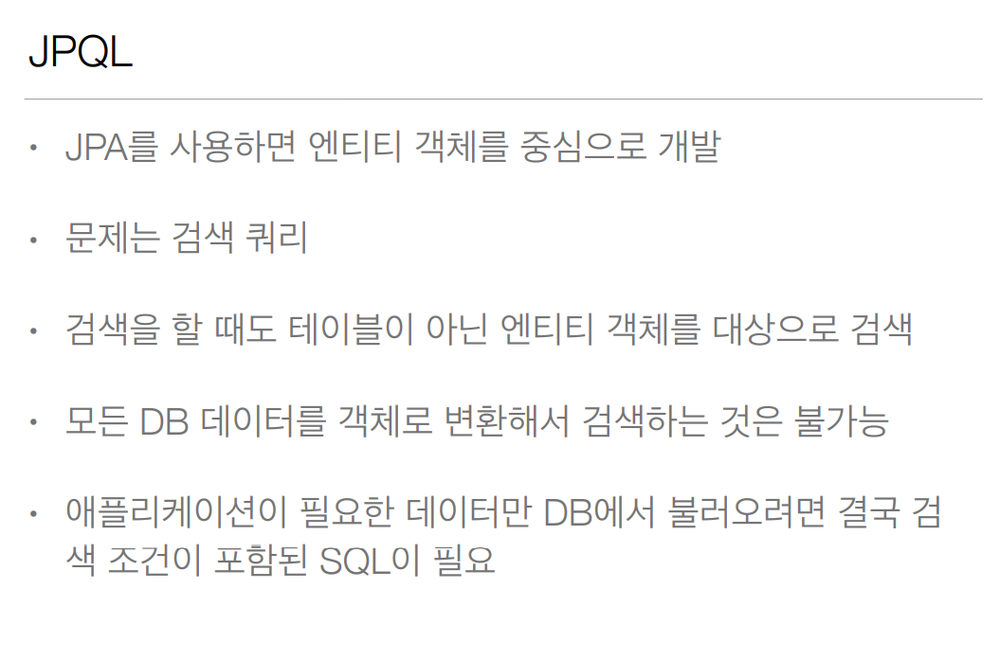
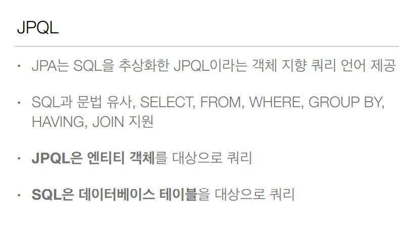
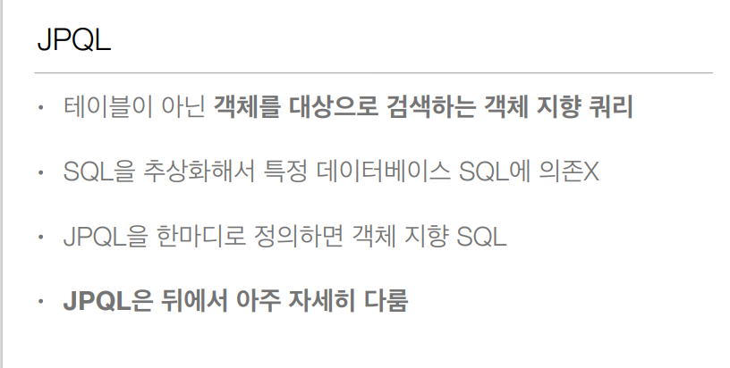

# JPQL

### - JPA 모든 데이터 변경은 `트랜잭션` 안에서 일어난다.

</br>

```java
public class JpaMain {

	public static void main(String[] args){ // jpa 시작
		EntityManagerFactory emf = Persistence.createEntitiyMAnagerFactory("hello");

		EntityManager em = emf.createEntityManager();
		
		EntityTransaction tx = em.getTransaction();
		tx.begin();
		
		Member member = new Member();
		member.setId(1L);
		member.setName("HelloA");
		
		em.persist(member);
		
		tx.commit();
		
		em.close();
		emf.close();
	}
}
```

<br/>

#### entity

JPA에서 Entity로 사용한다는 어노테이션.

```java
@Entity
public class Member{
	
	@Id // 기본키 어노테이션
	private Long id;
	private String name;
	
	// getter
	// setter
	
}
```

<br/>

#### JPQL

객체지향 쿼리.

- 나이가 18살 이상인 회원만 조회.

```java
List<Member> result = em.createQuery("select m from Member as m", Member.class)
                    .setFirstResult(5) // 5번 부터   -- 페이징 처리가 가능.
                    .setMaxResults(8)  // 8개 가져와
                    .getResultList();
					
for(Member member : result){
    System.out.println("member.name = " + member.getName());
}
```

- from 뒤에 Member가 대상이 테이블이 아니라, 객체가 되는 것.
- JPQL은 객체를 대상으로 하는 `객체지향 쿼리`라고 보면 된다!
- 기본적인 쿼리는 모두 지원.

<br/>



<br/>



## SQL 과 JPQL 차이점

- JPQL은 객체를 대상으로 쿼리, SQL은 데이터베이스 테이블을 대상으로 쿼리
- JPQL의 장점은 방언을 바꿔도 JPQL 코드를 바꿀 필요가 없다. 해당 DB에 맞는 문법으로
  알아서 JPA가 인식한다.

</br>

### 나중에 qureyDSL를 더하면 sql을 자바로 전부 바꿀 수 있다.




