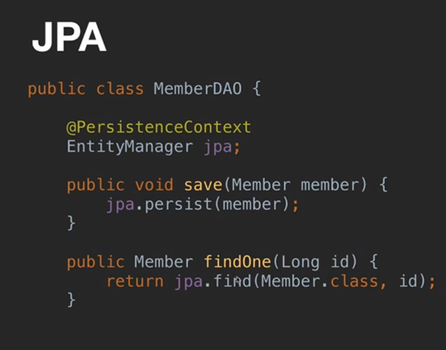
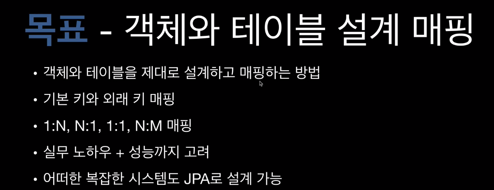
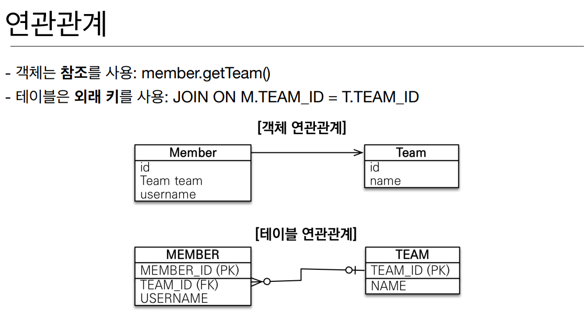
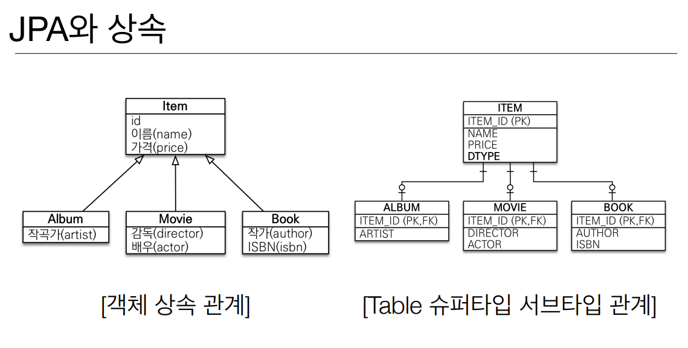

# 1. 강좌 소개

- 과거에는 객체를 데이터베이스에 저장하려면 복잡한 JDBC API와 SQL을 한땀한땀  작성해 줘야했다.
- 그런대, JDBC Template이나 mybatise 같은 sql mapper 같은 점에서 개발 코드는 많이 줄였지만, 개발자가 SQL을 한땀 한땀 작성하는 것은 똑같다.
- JPA가 나오면서 SQL을 한땀 한담 작성할 필요가 없어졌다.

 

- 위와 같이 단순한 객체를 저장하고 조회 하는 코드 한줄로 JPA가 던지면 된다. 
  마치 자바 컬렉션에 객체를 저장하고 조회하는 것 처럼 단순하게 JPA를 이용하면 된다.
- 그러면 JPA가 개발자 대신에 적절한 SQL 생성을 하고 데이터베이스에 실행을 해서 객체를 저장하거나 불러오게 된다.

- **SQL 한땀 한땀 생성**하는 것은 **개발에서 뒤 떨어질 수 밖에 없다**.
- **JPA를 사용하게 되면** 개발 생산성을 혁신할 수 있고 **개발 속도와 유지보수 측면**에서 이전과 확연하게 차이가 난다.

 

 

## JPA 실무에서 어려운 2가지 이유

- 객체와 테이블을 올바르게 매핑하고 설계하는 방법을 몰라서 그렇다.
  **실무에서**는 튜토리얼 처럼 객체란 테이블이 한 두개가 아니라 **못 해도 수십개가 얽혀서 돌아간다**.
  그런대,  **JPA서 중요한 점**이 **객체랑 테이블을 잘 설계하고 매핑을 정확하게 하는게 중요**하다.
  이걸 이해 못하면 복잡한 실무상황에서 어떻게 해야할지 **감 조차 안온다**.

- 그래서 막상 도입을 하면 고민만 하다 포기하거나 잘못된 매핑을 해서 두고 두고 고생을 한다.

 

 

- 그래서 이번 강의에는 객체와 테이블을 제대로 설계하고 매핑하는 방법을 정확하게 알려줄 것이다.
- 테이블의 기본키와 외래키를 어떻게 mapping 하는지 
- 복잡한 관계들을 JPA에서 어떻게 mapping 해야 하는지
- 명확한 기준을 가지고 실무 관점으로 노하우와 성능까지 고려해서 알려줄 것이다.

- JPA의 동작 방식을 이해하지 못하고 사용하면 디버깅 되게 오래걸리고, 최악의 경우 장애 상황에서 대처가 안된다.
- JPA가 어떤 SQL을 만들어 내는지, 언제 SQL을 실행하는지를 이번 강의를 다 보고 나면 우리의 머리 속에 그려질 것이다.

 

##  JPA를 많이 사용하나요?

- 최근 몇년 동안 꾸준히 JPA 검색량이 올라가고 있다.
- 나중에 2~3년 안에 JPA의 점유율이 높아질 것이라고 확신한다.

 

 

# 2. SQL 중심적인 개발의 문제점

- **이번 시간 강의**가 전체 시간 강의 중에 **가장 중요**하다.

 

## SQL 중심적인 개발의 문제점

- 지금 시대는 **객체를 관계형 DB에 관리**해야 한다.
- 문제는 코드를 까보면 다 SQL이다. 데이터베이스는 SQL만 알아들을 수 있기 때문.
- **결국에는 SQL 중심적인 개발이 되는게 문제**다.

 

- 기획자가 회원을 설계해달라고 기획서를 줬으면 회원테이블을 만들고 회원 객체 만들고 DB에 넣을려고 쿼리를 짜고있다.
- 갑자기 개발이 다 끝났는대 연락처 컬럼을 추가해 달라고 연락이 온다.

- 그러면 객체에도 연락처 컬럼을 넣고, member 테이블에도 연락처 컬럼을 추가하고 null로 셋팅을 한 뒤 SQL 쿼리에서도 맞춰서 다 수정해 줘야한다.
- 그래서 이 것들을 다 한땀 한땀 수정해 줘야한다.
- 그러면 서비스 오픈해 놓고 보면 조회나 그런 부분에는 수정을 하였지만, 
  연락처 수정을 하려고 하면 연락처 수정이 안되어서 **코드를 보면 연락처 컬럼 부분이 빠져있는 상황**이 발생할 수 있다.

 

### 결국 여기서 하고싶은 말

- **관계형 DB를 쓰고있는 상황**에는 SQL에 의존적인 개발을 피하기 어렵다.

## 패러다임의 불일치 문제

- 애초에 관계형 데이터베이스 나온 사상이랑 객체지향이 나온 사상이랑 완전히 다르다.
- 관계형 DB는 데이터를 잘 정규화 해서 보관을 하는게 목표
  객체는 속성과 필드 메서드가 결국 묶여서 잘 캡슐화 하는게 목표다.
- 그래서 이 2개가 패러다임이 안 맞는대 이 객체를 관계형 DB에 넣을려니 여러가지 문제가 생긴다.

- JPA는 상속, 연관관계, 객체 그래프 탐색 비교하기가와 같은 패러다임의 불일치 문제를 해결해준다.

 

- 현실적인 대안은 관계형 DB이다.

 

- 객체를 SQL로 바꿔야 하는대 이것을 누가 하냐?
  개발자 = SQL 매퍼 --> 우리가 하는 것이다.

 

- **객체에는 상속 관계가 있지**만 정확하게 객체와 동일한 상속 관계가 아닌 유사한게 있긴 하지만 
  **관계형 DB에는 없다고 생각**하면 된다.
- 객체는 참조를 가지고 한다.  -> get 뭐뭐
  데이터 베이스에서는 PK, FK로 JOIN을 통해 필요한 데이터를 다 찾을 수 있다.

 

- 객체 상속관계를 설계 했는대 DB에 밀어 넣어야 하는대 어떻게 해야하느냐?  -> 대부분 어려워서 포기.
- 그런대 **객체의 상속 관계와 그나마 유사한 모델**이 **Table 에는 슈퍼타입 서브타입 논리 모델**이 있다.
  이게 그나마 객체의 상속 관계와 그나마 유사하다.

 

- 예를 들어 `앨범`을 저장을 하려면 어떻게 해야하냐?
- 제일 먼저 `앨범 `객체를 분해하고 테이블이 앨범을 생성한 다음에 `ITEM` 객체를 상속 받았으니 `ITEM 속성`을 앨범이 들고 있겠죠?  그러면 **DB에 넣을 때 다른 INSERT 쿼리(아이템, 앨범에 INSERT 하는 )를 2번 작성**해야 한다.  -> 왜냐하면 테이블이 쪼개져 있으닌깐.
- 그럼 INSERT는 어떻게 해결하였지만, 문제는 **조회**할 때다.

 

- DB가 아닌 자바 컬렉션에 저장한다고 가정해 보자.

- 자바 컬렉션에 넣게 되면 정말 Simple해 지는대 관계형 DB에 넣고 빼내는 순간 그 중간에 SQL 매핑 작업을 
  개발자가 다 한땀 한땀 해주는게 번잡한 것이다.

 

- 객체는 `참조`를 통하여 연관된 아이를 찾아갈 수 있다.
- 테이블은 외래 키를 사용하여 JOIN하면 갈 수 있다.
- 그런대 위 그림을 보면 `Member`은 **Team 객체가 참조** 되어 Team 객체로 갈 수 있지만, `Team`에서는 **Member로 못 간다**. 참조가 없기 때문.
- 테이블은 객체와 다른게 TEAM 테이블의 기본키로 MEMBER 테이블로 조인하여 갈 수 있다. 즉 테이블은 **양 방향성**이 가능 하지만, **객체는 단 방향**으로 밖에 안 흘러간다.

 

- **서로가 참조가 있다는 가정**하에 Member.**get**Team(), Member**.get**Order() 이런식으로 자유롭게 탐색할 수 있어야 한다.

- 그런대 여기서 문제가 있다.
  처음 실행한 SQL에 따라서 탐색 범위가 이미 결정되어 버린다. 예를들어 처음 조회할 때 Member, Team 테이블을 가져왔다. 그럼 Member, Team만 가져와서 값을 채워 넣었으니 member.getOrder();을 하게 되면 null을 반환한다. 그러면 Member 필드안에 Order가 있다고 해서 값을 못 꺼내는 것이다.
- **엔티티 신뢰 문제 발생**한다.

- Member 객체를 찾았고, Member 객체에 Team도 있고 Order 도 있으니 Order에 있는 Delivery 값을 호출 할 수 있네?  -> **이거 호출 못 한다**.  왜냐하면 **meberDAO안에 뭘 했고** 어떤 쿼리를 날라가서 **어떻게 데이터를 조립했는지 눈으로 확인하지 않는 이상** 이 반환된 meber 객체를 **신뢰하고 쓸 수 없다**.

- **SQL을 직접 다루게 되면** 계층형 아키텍처에서 진정한 의미의 **계층 분할이 어렵다**.
- 물리적으로 계층이 Service, Dao 나눠져 있지만, 논리적으로는 굉장히 간결합 되어 있다.

 

#### 그래서 객체답게 모델링 할수록 매핑 작업만 늘어나고 더 힘들어진다.

#### 객체를 자바 컬렉션에 저장 하듯이 DB에 저장할 수는 없을까?

#### -> 그 고민의 결과가 바로 JPA - JAVA Persistence API 이다.

 

# JPA 소개

## JPA란?

- Java Persistence API
- 자바 진영의 **ORM** 기술 표준이다.

 

## ORM?

- Object-relational mapping(객체 관계 매핑)
- **객체는 객체대로 설계**
- 관계형 데이터베이스는 관계형 데이터베이스대로 설계
- **ORM 프레임워크가 중간에서 매핑**
- 대중적인 언어에는 대부분 ORM 기술이 존재

 

- **JPA에게 명령을 하면** JPA가 `JDBC API를 사용`해서 SQL을 호출하고 만들어서 보내고 
  그 결과를 받아 동작을 하게 된다.

 

- JPA 에게 Member 객체를 넘긴다.
- JPA가 Member 객체를 분석한다. 그래서 JPA가 적절한 INSERT 쿼리를( **개발자가 직접 만들지 않고** ) 생성한다. 
- 그리고 JPA가 JDBC API를 사용하여 INSERT 쿼리를 DB에 보내고 결과를 받는다.

 

## JPA는 표준 명세

- JPA는 **인터페이스의 모음** 
- JPA 2.1 표준 명세를 구현한 3가지 구현체 
- 하이버네이트, EclipseLink, DataNucleus

 

## JPA를 왜 사용해야 하는가? 

- SQL 중심적인 개발에서 **객체 중심으로 개발**
- 생산성
- 유지보수
- 패러다임의 불일치 해결 
- 성능
- 데이터 접근 추상화와 벤더 독립성
- 표준

## 생산성 - JPA와 CRUD

- 저장: **jpa.persist**(member) 

- 조회: Member member = **jpa.find**(memberId) 

- 수정: **member.setName**(“변경할 이름”)

- 삭제: **jpa.remove**(member)

 

- 서비스 오픈 직전 악덕 기획자가 연락처 컬럼을 추가해 달라고 할 경우 위에서는 쿼리 한땀 한땀 다 수정을 해야한다. 언제 다하냐 ....

- **JPA를 사용하게 되면** DB에 컬럼 테이블이 추가되어 있다는 가정하에 **필드만 추가**해 주면 된다. 
  SQL은 JPA가 처리하기 때문.

 

## JPA와 패러다임의 불일치 해결 

1.JPA와 상속

 2.JPA와 연관관계 

3.JPA와 객체 그래프 탐색

 4.JPA와 비교하기

 

- `JPA가` **INSERT 쿼리를 두개로 쪼개서** 만들어준다.

 

- 조회할 때도 앨범을 조회하고 싶으면, 앨범 클래스와, 앨범 PK를 넘겨주면 
  I**TEM과 ALBUM을 JOIN 하여 데이터를 가져온다**.

 

- member 에다가 Team을 셋팅하고 저장하면 member가 DB에 저장된다.
- 그 다음에 jpa.find() 해서 member 객체를 가져왔다. 그 다음에 meber.getTeam();을 통해 팀을 꺼내올 수 있다. **마치 자바 컬렉션에 넣었던 것 처럼!** 

 

 

###  성능

- JPA는 애플리케이션과 데이터베이스 사이에서 **다양한 성능 최적화 기회를 제공**한다.
- 예를들어 SELECT SQL을 한 번만 데이터베이스에 전달하고 두 번째는 조회한 **회원 객체를 재사용**한다.
- 그 밖에 **다양한 캐싱 기술들이 있고 이것을 적극 활용하면 성능이 좋아질 수 있다**.

 

<b/>

- Member와 Team이 연관이 되어있지만 **meber만 SELECT 쿼리가 나가는 것**.
- 그럼 실제 이 SELECT 쿼리에서 member.getTeam()을 통해 team 객체를 가져왔다. 
  그런대 이 team객체의 어떤 값을 건들때, 필요한 시점에 JPA가 DB에 TEAM 테이블에 대한 SELECT 쿼리가 나가서 조회한다.  --> 이게 바로 `지연 로딩`이다.
- 그런대 **지연로딩**의 문제가 **쿼리가 2번 나간다**. -> 네트워크를 2번 타는 것.
- **JPA에 옵션**이 있다.  Member을 조회하면 항상 Team은 같이 가져와라고 해서 JOIN을 해서 가져오는 것.
  이것도 **옵션을 왔다 갔다 할 수 있다**.
- 그래서 애플리케이션 개발을 할 때 지연로딩으로 하다가 **최적화가 필요하다면 즉시 로딩 옵션을 사용**.

 

 