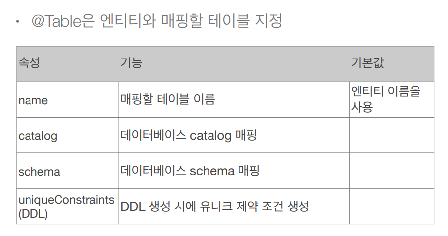
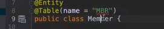
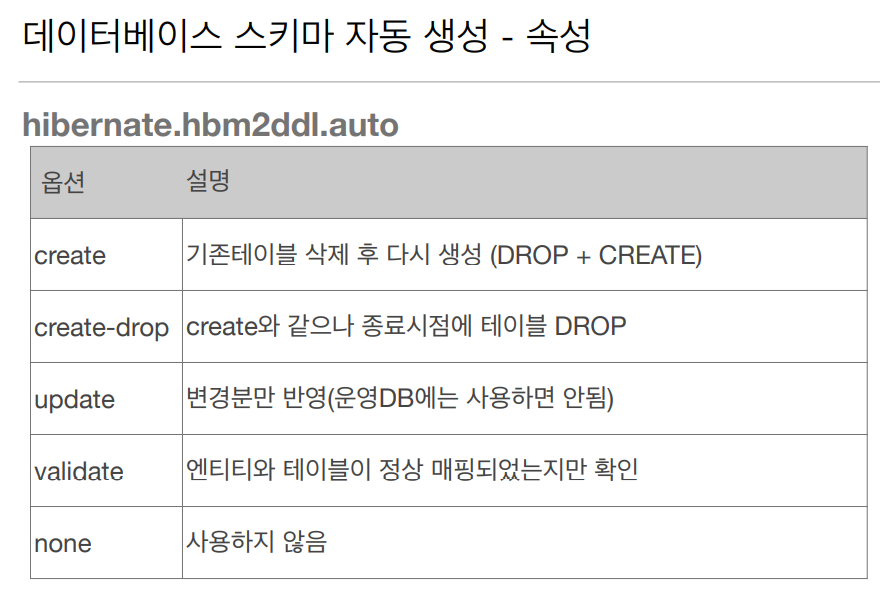
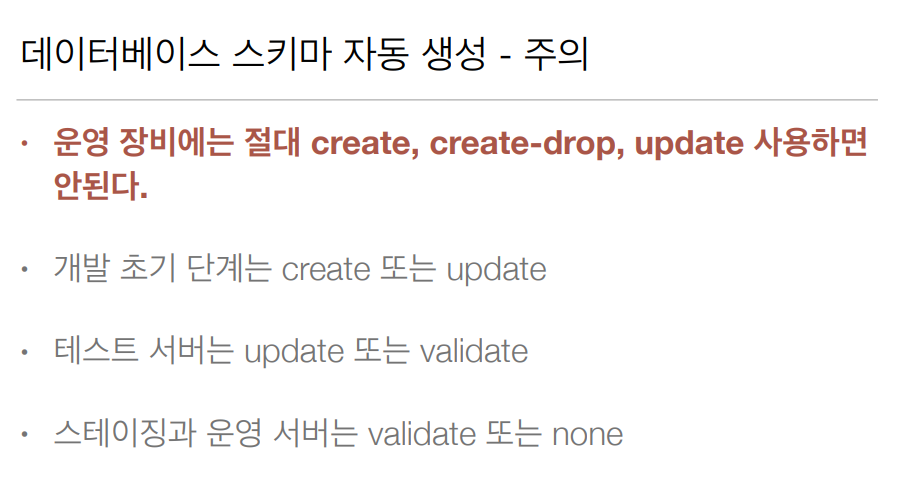

# 엔티티 매핑

## 엔티티 매핑 소개 

- 객체와 테이블 매핑: **@Entity, @Table** 
-  필드와 컬럼 매핑: **@Column** 
-  기본 키 매핑: **@Id** 
- 연관관계 매핑: **@ManyToOne,@JoinColumn** 

<br/>

## 객체와 테이블 매핑

### @Entity

- @Entity가 붙은 클래스는 JPA가 관리, 엔티티라 한다.  

  - **@Entity가 붙은 클래스**는 JPA가 관리하는 엔티티 이다.
  - @Entity가 **붙지 않으면** `JPA와 전혀 관계 없는`마음대로 쓰고싶은 클래스라고 보면 된다.

-  JPA를 사용해서 테이블과 매핑할 클래스는 @Entity 필수 •

- ### **주의** 

- **기본 생성자 필수**(파라미터가 없는 public 또는 protected 생성자)  

-  final 클래스, enum, interface, inner 클래스 사용X   -> @Entity를 붙여서 사용 못 함.

-  저장할 필드에 final 사용 X

<br/>

## @Entity 속성 정리

### 속성 : name 

- JPA에서 사용할 엔티티 이름을 지정한다.  
- **JPA가 내부적으로 구분하는 이름**이라고 보면 된다.
- 기본값: **클래스 이름을 그대로 사용**(예: Member)  
- 같은 클래스 이름이 없으면 가급적 기본값을 사용한다.

```java
// @Table(name = "Member") defalut값 사용하는 것을 권장
@Entity // defalut
class Member {
	
	@Id
	private Long id;
    
    	@Column(unique = true, length = 10) // DDL 생성 기능.
	private String name;
	
	public Member() {} // 기본 생성자
	public Member(Long id, String name) {
		this.id = id;
		this.name = name;
	}
	
	// getter
	// setter
}
```

<br/>

## @Table





- **Member 클래스**를 **데이터베이스 MBR 테이블과 매핑**하게 된다.
- 그래서 **실제 INSERT 문이 나갈때**는 INSERT INTO MBR 로 나가게 된다.

<br/>

## 데이터베이스 스키마 자동 생성

- **DDL을 애플리케이션 실행 시점**에 **자동 생성** 
- 테이블 중심 -> 객체 중심
- 데이터베이스 **방언을 활용**해서 **데이터베이스에 맞는 적절한 DDL 생성**
- 이렇게 **생성된 DDL은 `개발 장비에서만` 사용** 
- 생성된 DDL은 **운영서버에서는 사용하지 않거나**, 적절히 다듬 은 후 사용

<br/>



<br/>

- 방언별로 알아서 적절한 sql.
- 운영에서 create, create-drop, update는 사용하면 안됨. -> 진짜 큰일난다.
- **개발 초기 단계**에서는 create 또는 update를 자기 로컬과 개발 서버에서 쓰시면 된다.
- **어느정도 개발이 진행**되었다면 update 또는 validate를 쓰면 되고
  - 여러명의 개발자가 함께 사용하는 중간 서버에
    create 쓰면 데이터가 다 날라가 버려서 `쓰면 절대 안된다.`
- 개발하면서 느끼는건대 테스트 서버나 개발 서버라도 가급적이면 쓰지마라. 운영 서버는 특히 쓰지말고!
  왜냐하면 데이터 몇천만건이 있는 상태에서 Alter을 잘 못 하게되면 시스템이 중단 상태가 될 수도있다.
- 본인이 직접 스크립트를 짜고 문제 없으면 DBA 분한테 전달하고 검수를 받고 적용하는 것을 권장 드린다. 

<br/>

## DDL 생성 기능

- 제약조건 추가: 회원 이름은 `필수`, 10자 초과X  
  - @Column(**nullable = false**, length = 10)  

- **유니크 제약조건** 추가 
  -  @Table(uniqueConstraints = {
    	@UniqueConstraint( 
    			name = "NAME_AGE_UNIQUE", columnNames = {"NAME", "AGE"} 
    			)
    		}
    )  
- **DDL 생성 기능**은 **DDL을 자동 생성할 때만 사용**되고 **JPA의 실행 로직에는 영향을 주지 않는다**.

