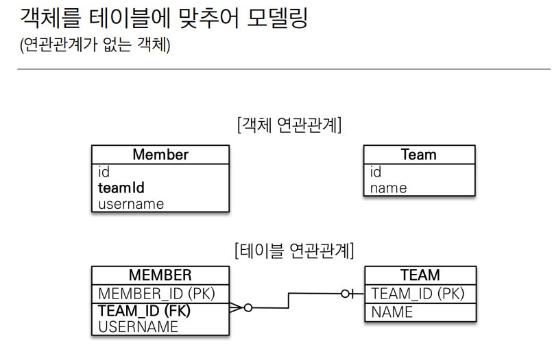
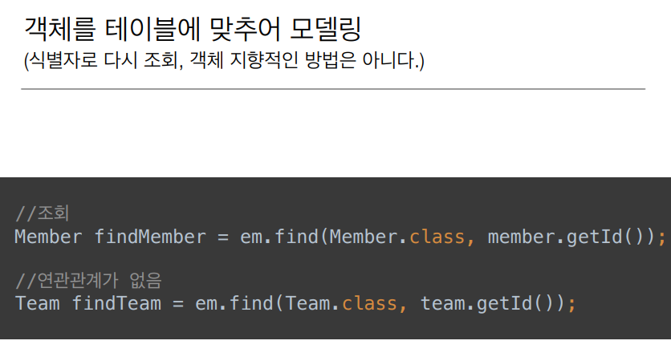
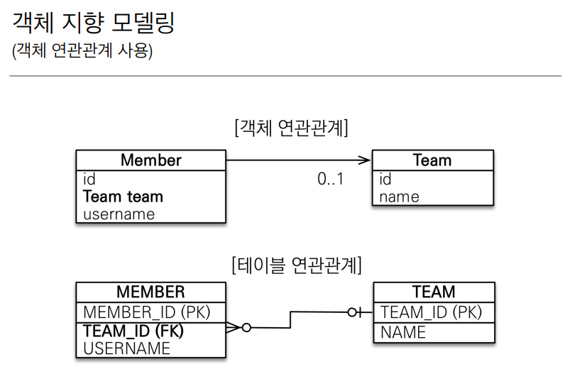
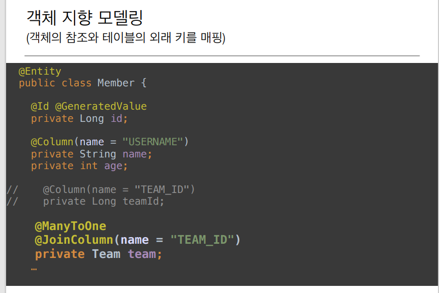
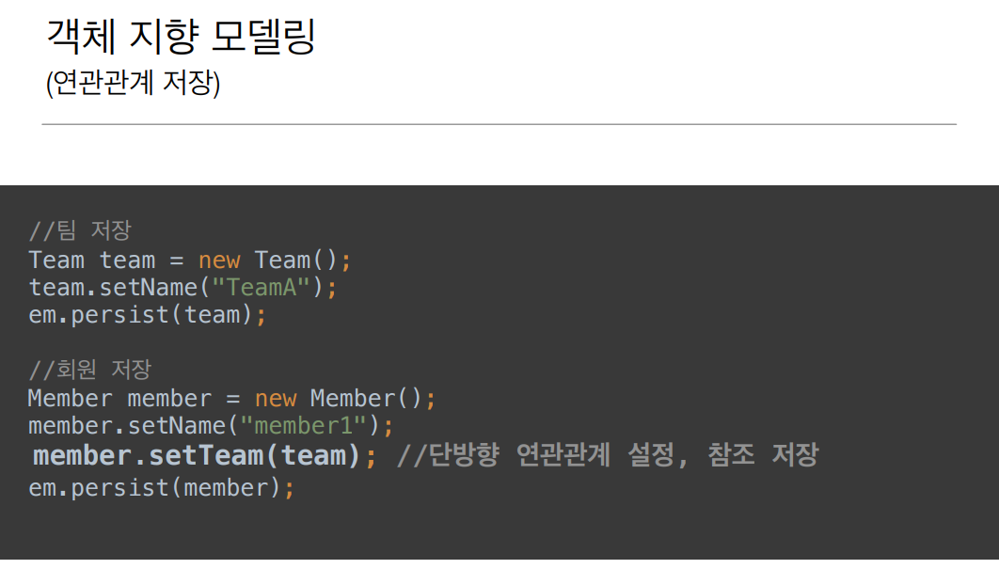
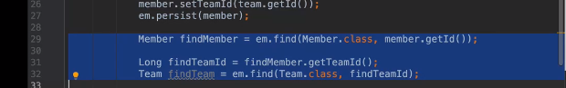
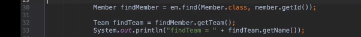

# 단방향 연관관계

## 목표 

- 객체와 테이블 연관관계의 차이를 이해

- 객체의 참조와 테이블의 외래 키를 매핑
- 용어 이해 
  - **방향**(Direction): 단방향, 양방향 
  - **다중성**(Multiplicity): 다대일(N:1), 일대다(1:N), 일대일(1:1),  다대다(N:M) 이해 
  - **연관관계의 주인**(Owner): 객체 양방향 연관관계는 **관리 주인 이 필요**

 

## 연관관계가 필요한 이유

- ‘객체지향 설계의 **목표**는 자율적인 객체들의  **협력 공동체**를 만드는 것이다.

- 위에서 외래키 값을 **참조 대신에 그대로 사용.**

 

객체를 테이블에 맞추어 **데이터 중심으로 모델링**하면,  **협력 관계를 만들 수 없다**. 

- **테이블은 외래 키로 [조인]**을 사용해서 연관된 테이블을 찾는다.  
- **[ 객체는 참조 ]**를 사용해서 **연관된 객체를 찾는다**.  
- 테이블과 객체 사이에는 이런 큰 간격이 있다

 

-  **객체지향 스럽게 모델링** 하는 것은 위와 같이 외래키를 직접 변

 

- Member 입장에서는 **@ManyToOne 어노테이션**을 해야한다.

  **Member 입장**에서는 Many고 **Team으로**는 One이 되는 것

- 그리고 객체에서 Team team;이 **테이블 연관관계에서 TEAM_ID(외래키)를 매핑** 시키기 위해 **@JoinColumn 어노테이션**을 사용한다. 

- 즉 **관계가 뭔지**랑, 이 관계를 할 때 **조인하는 컬럼이 뭔지 적어주면** `매핑`이 끝난다. 

 

- 위처럼 meber.setTeam(team);을 하게 되면 **JPA가 알아서 Team의 PK 값을 꺼내**서 

​     `외래키에 INSERT 할때 사용`을 한다.

조회 할 때도 이전 데이터 중심과 달리 코드가 달라진 것을 아래에서 확인할 수 있다.

|                         데이터 중심                          |                          객체 중심                           |
| :----------------------------------------------------------: | :----------------------------------------------------------: |
|  |  |

- 객체 지향 스럽게 바로 객체를 가지고 올 수 있는것을 확인할 수 있다.

### 정리 

-  객체의 참조와 DB의 외래키를 매핑해서 연관관계 매핑을 할 수 있다 정도 알면 된다.

