# 영속성 관리

### JPA에서 가장 중요한 2가지

- 객체와 관계형 데이터베이스 매핑하기 (Object Relational Mapping)

- 영속성 컨텍스트

<br/>

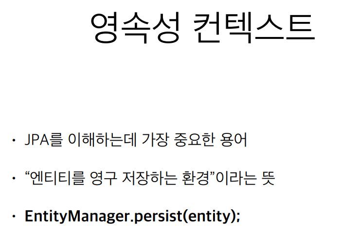

- persist 메서드는 사실 DB에 저장하는 것이 아니라 entity를 영속성 컨텍스트라는 곳에 저장하는 것이다.

<br/>

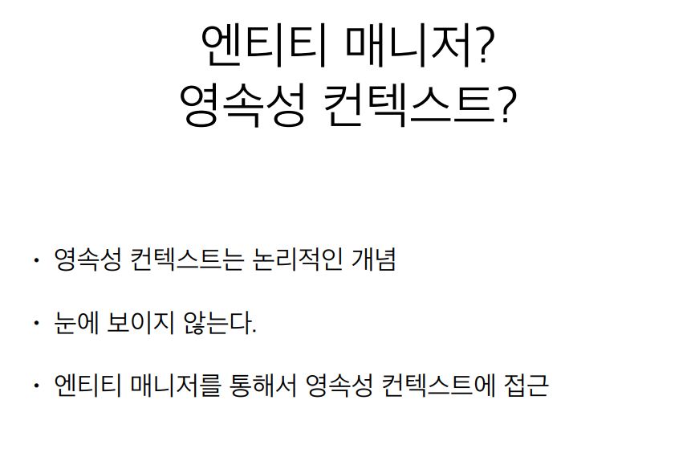

<br/>

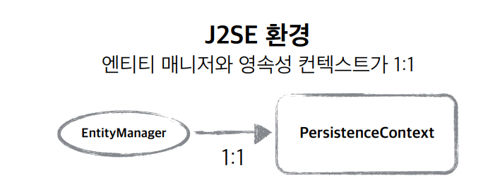

- 엔티티 매니저(EntityManager)를 생성하게 되면 사실 그 안에 1:1로 영속성 컨텍스트가 생성이 된다.
  쉽게 말하자면 엔티티 매니저 안에 영속성 컨텍스트 라는 것이 **눈에 보이지 않는 공간이 생긴다**고 이해하면 됨

<br/>

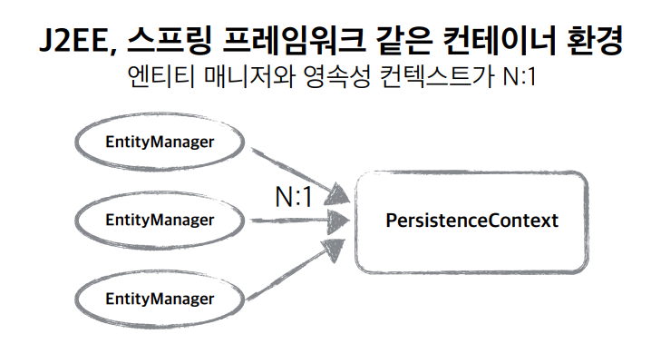

- 이 부분은 나중에 스프링 프레임워크를 해야 이해할 수 있어서 넘어간다.

<br/>

## 엔티티의 생명주기

- **비영속 (new/transient)** 
  - 영속성 컨텍스트와 전혀 관계가 없는 **새로운** 상태
  - ex) 최초의 member 객체를 생성한 상태

- **영속 (managed)** 
  - 영속성 컨텍스트에 **관리**되는 상태
  - ex) entitymanger.persiste() 인 경우

- **준영속 (detached)** 
  - 영속성 컨텍스트에 저장되었다가 **분리**된 상태  

- **삭제 (removed)** 
  - **삭제**된 상태

<br/>

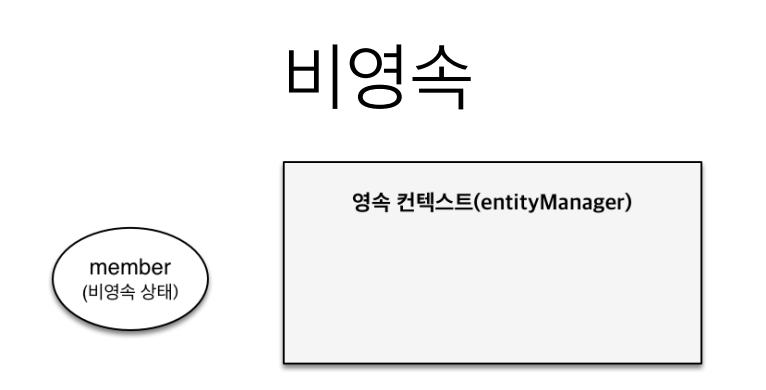

```java
//객체를 생성한 상태(비영속) 
Member member = new Member(); 
member.setId("member1"); 
member.setUsername("회원1");
```

<br/>

- **비영속 상태**는 member 객체를 생성을 하고 **entityManager 에 아무것도 안 넣은 것**.
- JPA와 전혀 관계가 없는 상태를 말함.

<br/>

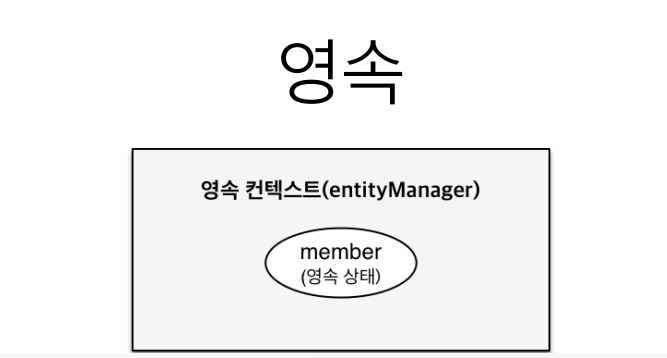

```java
//객체를 생성한 상태(비영속) 
Member member = new Member(); 
member.setId("member1"); 
member.setUsername(“회원1”);
EntityManager em = emf.createEntityManager();
em.getTransaction().begin();
//객체를 저장한 상태(영속)
em.persist(member);

```

>- entityManager 안에는 **영속성 컨텍스트**가 있다.
>
>- member 객체를 생성한 다음에 EntityManager를 얻어와서 EntityManager에 persist 해서 member 객체를 집어넣으면 영속 상태가 된다.
>- 이때 DB에 저장되지는 않는다.

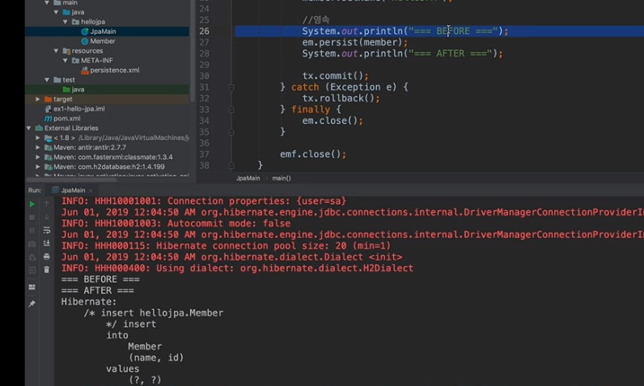

- Before, After 사이에 **쿼리가 날라가지 않는 것을 볼 수 있다**.
- **트랜잭션을 commit 하는 시점**에 영속성 컨텍스트 안에 있는 아이가 **쿼리로 날라간다**.

<br/>

## 준영속, 삭제

```java
//회원 엔티티를 영속성 컨텍스트에서 분리, 준영속 상태 
em.detach(member);
```

- **detach를** 하게 되면 **영속성컨텍스트에서 지우게 된다**. ( 아무 관계가 없어지는 것.)

```java
//객체를 삭제한 상태(삭제) 
em.remove(member);
```

- **remove는** **실제 DB삭제를 요청하는 상태**이다.  
  실제 영구 저장한 DB에서 지우겠다라는 상태라고 보면 됨.

<br/>

> 애플리 케이션이랑 데이터베이스 사이에 무언가 중간 계층(영속성 컨텍스트)이 있는 것이다.
>
> 이걸 가지고 큰 이점이 있다.

<br/>

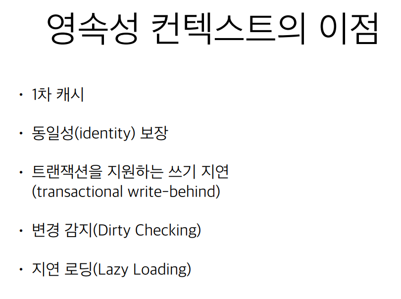

<br/>

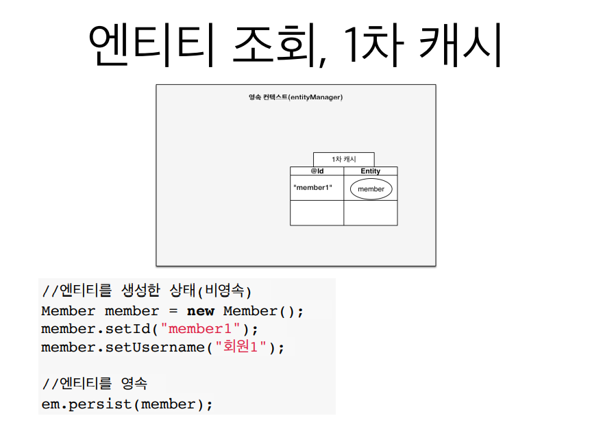

- 사실 이 `1차 캐시`를 영속성 컨텍스트라고 이해해도 된다.
  **key 가** 기본키인 member1 **값(value)이** em.persist로 저장한 member가 된다.

<br/>

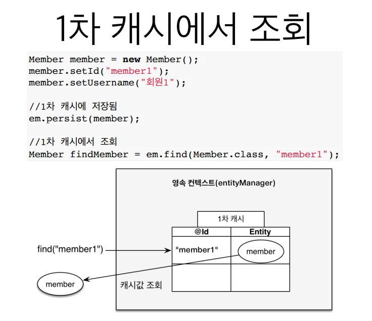

- 조회할 때 **먼저 1차 캐시를 뒤진다**. DB를 뒤지는 것이 아니라.
  즉, 조회할 때 1차 캐시를 먼저 뒤지는 이점이 있다.

<br/>

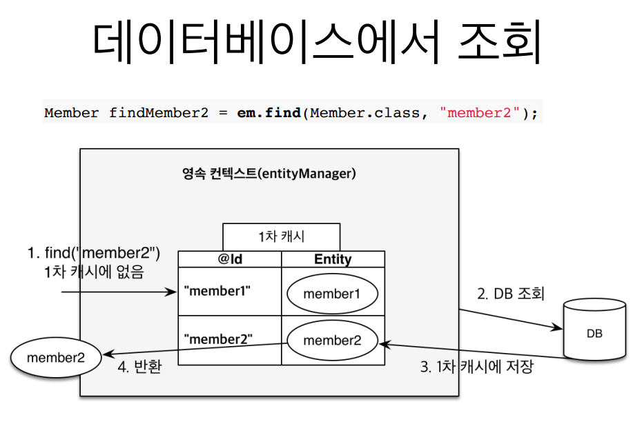

- 이전 까지 member2가 **1차 캐시에 없었다**. 그러면 JPA가 ''영속성 컨텍스트 안에 있는 1차 캐시 안에 member2가 없네?' 그러면 **DB에서 조회**한다. **DB에 조회**한 **member2를 1차 캐시에 저장**한다.
- 그리고 **member2를 반환**한다.
- 이후에 **member2를 다시 조회**하게 되면 `영속성 컨텍스트 안에 있는 1차 캐시 안에 member2가 반환` 된다.
  **DB를 조회하지 않고**. 
- 사실 이게 `큰 도움은 안 된다`. entityManager 는 고객 요청 하나 들어와서 비즈니스가 끝나버리면 
  **영속성 컨텍스트가 지워 버린다는 것 이기 때문에 1차 캐시를 다 지운다는 것**. 
  굉장히 짧은 순간에 이득이 있기 때문에 **여러명의 고객이 사용하는 캐시가 아니다**.
- `애플리케이션 전체에서 공유하는 캐시`는 JPA나 하이버네이트에선 **2차 캐시**라고 한다.
- **1차 캐시**는 데이터베이스 한 트랜잭션에서만 효과가 있기 때문에 사실 막 `성능 이점을 얻을 수 있는 장점은 아니다`.
- 그래도 비즈니스 로직이 굉장히 복잡할 때는 도움이 되는 경우가 있겠다.

<br/>

## 영속 엔티티의 동일성 보장

```java
Member a = em.find(Member.class, "member1"); 
Member b = em.find(Member.class, "member1");
System.out.println(a == b); //동일성 비교 true
```

- **자바 컬렉션**에서 똑같은걸 가져와서 '==' 비교하면 똑같다.
- JPA에서도 영속 엔티티의 동일성 보장한다. -> 1차 캐시가 있기 때문에 가능한 것.
- 1차 캐시로 반복 가능한 읽기(REPEATABLE READ) 등급의 트랜잭 션 격리 수준을 데이터베이스가 아닌 
  애플리케이션 차원에서 제공
  그냥 데이터베이스 같은 트랜잭션 안에서 실행을 해서 '==' 비교를 하면 TRUE가 나온다.

<br/>

## 엔티티 등록 트랜잭션을 지원하는 쓰기 지연

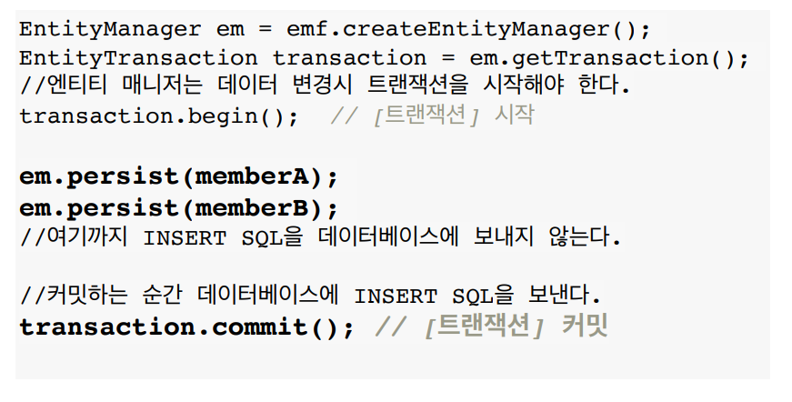

<br/>

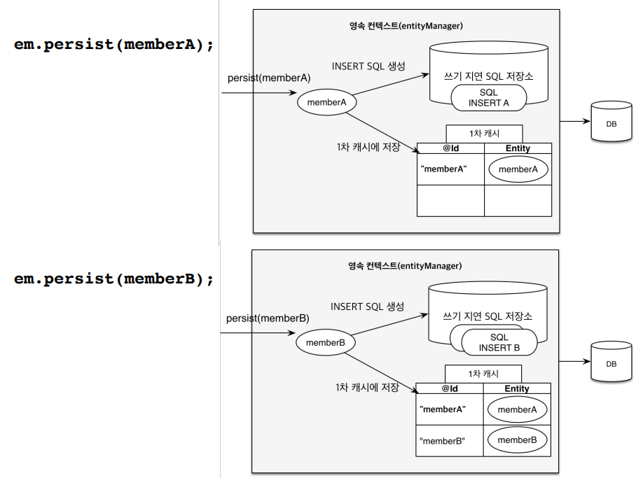

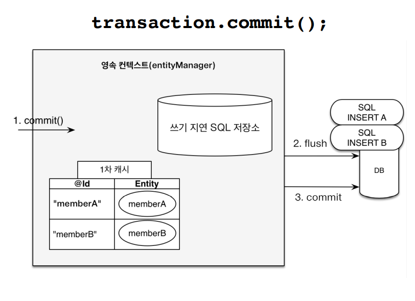

- commit()을 할 경우 쓰기 지연 SQL 저장소에 있던 쿼리가 **flush 되며 날라간다**.
- 그리고 실제 데이터베이스 **트랜잭션이 commit 된다**.

```java
<property name = "hibernate.jdbc.batch.size" value="10" />
```

>하이버네이트에는 **위와 같은 옵션**이 있다.  이 옵션을 주면 **이 사이즈만큼 모아서** 
>데이터베이스에 `한 방에 네트워크로 쿼리를 보내고 DB를 commit` 한다.

- 버퍼링 같은 기능. 모았다가 DB에 한 번에 보내는 것. 
- 사실 실시간 쿼리에서 큰 이점이 있지는 않지만 **JPA를 써서 이점을 얻을 수 있다**. 성능이 더 떨어지지 않음.
  오히려 **옵션 하나로 먹고 들어갈 수 있다**.

<br/>

## 엔티티 수정 (변경 감지)

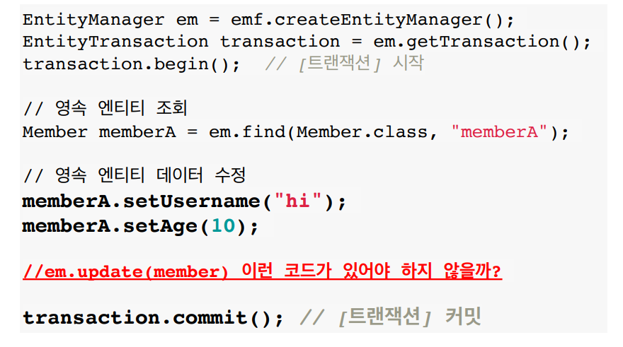

- JPA는 내가 찾아온 다음 **데이터 값을 변경**을 한다. 
  그 다음 마치 내가 자바 컬렉션 값만 다뤘는대 **업데이트 쿼리가 나간다**.
- JPA는 `변경 감지` 라는 기능으로 마치 자바 컬렉션에 하는 것 처럼  UPDATE 요청을 하지 않아도 변경이 된다.
- 비밀은 아래 영속성 컨텍스트 안에 다 있다.

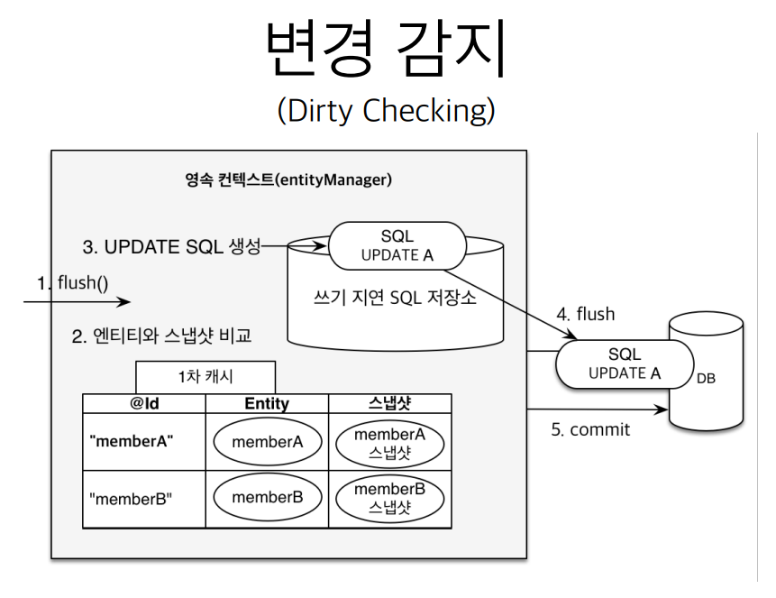

- 데이터베이스 트랜잭션 COMMIT하는 시점에 내부적으로 flush가 호출된다.
- 데이터베이스 트랜잭션 COMMIT하면 그 때 `엔티티와 스냅샷을 비교`한다.
  **스냅샷**은 내가 값을 읽어오는 그 시점 `최초로 영속성 컨텍스트 안에 들어온 시점의 상태를 스냅샷을 떠 둔다.`
- 앤티티와 스냅샷 비교를 해 보고 **memberA가 바뀌었다면**
   `UPDATE 쿼리를 쓰기 지연 SQL 저장소`에  만들어 둔다.
- 그리고 **UPDATE 쿼리를 DB에 반영**하고 **COMMIT을 한다**.

<br/>

## 엔티티 삭제

```java
//삭제 대상 엔티티 조회 
Member memberA = em.find(Member.class, “memberA");
em.remove(memberA); //엔티티 삭제
```

- 이것도 위 변경 감지 메커니즘과 똑같다.

