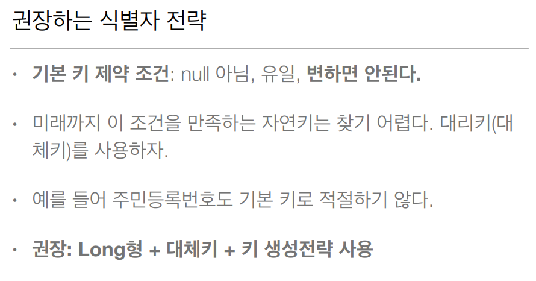
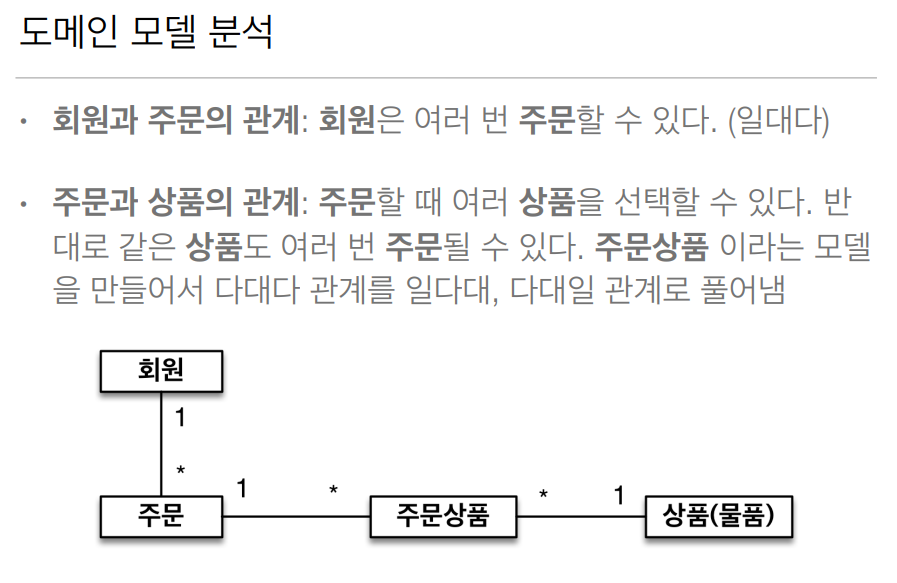
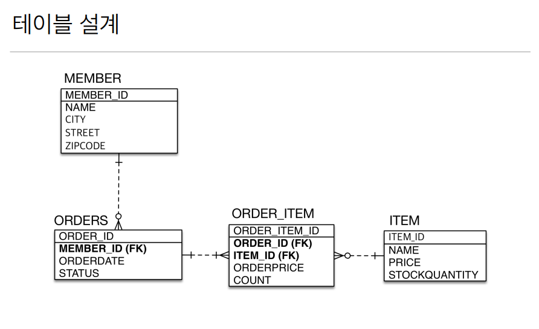
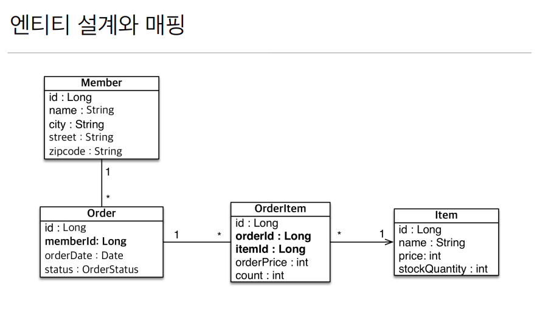

## 요구사항 분석

- 회원은 상품을 주문할 수 있다
- 주문 시 여러 종류의 상품을 선택할 수 있다.

 

 

 

- 보통 처음에는 위 처럼 테이블 모델링을 보고 만든다. **위 설계의 문제점을 설명해 줄 것**이다.

- 뭔가 객체지향 스럽지 않다는 느낌이 온다. 

- 그래서 private Long memberId; 가 아닌 **private Member member; 이렇게 선언**해 줘야 되겠다.

- memberId만 있는 것이 아니라, 
  member 객체를 참조해서 order.getMember();로 바로 끄집어 낼 수 있어야 한다.

  > 객체는 **객체 그래프로 참조로 쭉쭉 찾아나갈 수 있어야 한다**. 
  > 그런대 memberId 처럼 식별자가 바로 있으면 끊겨 버려서 찾아나갈 수 없다.

-  Order 클래스의 private Long memberId;는 `객체를 관계형 DB에 맞춘 설계`다.

 

- 그래서 다음 시간에 **연관관계 매핑에 대해서 배운다**. 객체 지향 설계에 대한 내용.

