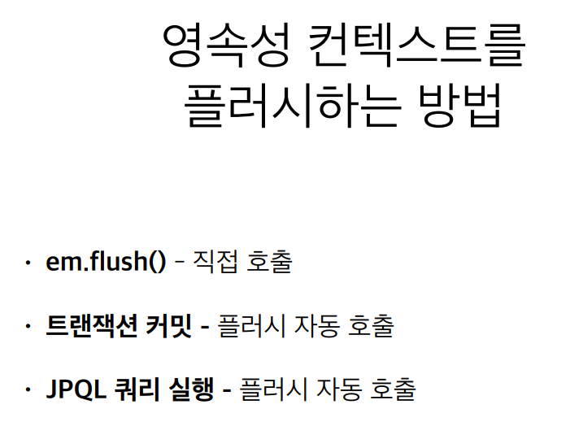
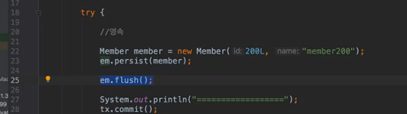
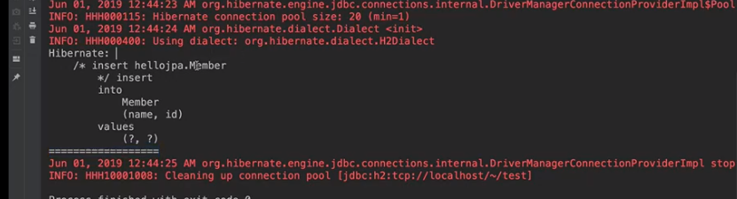
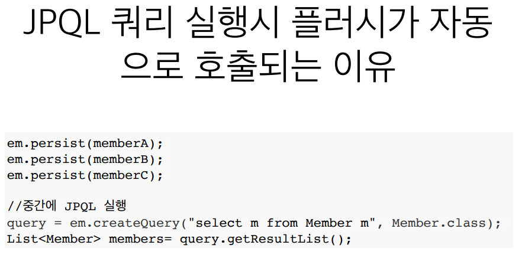
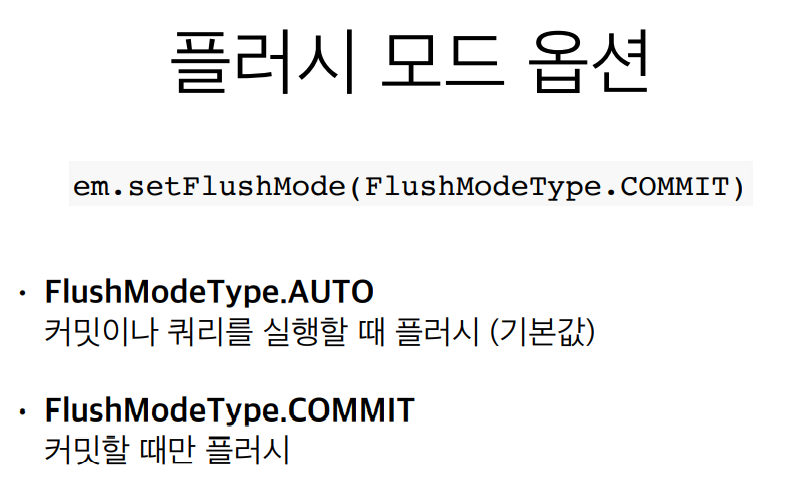
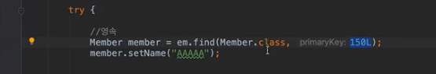
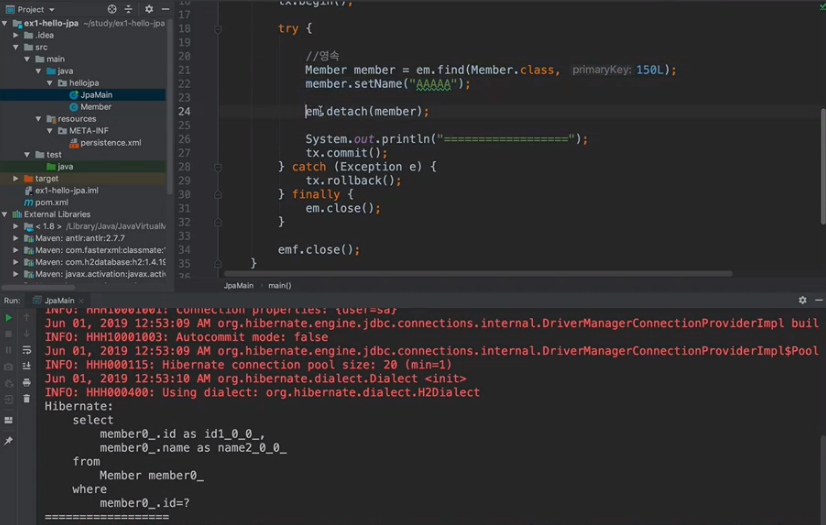

## 플러시

- 영속성 컨텍스트의 변경내용을 데이터베이스에 반영
- 보통 데이터베이스 **트랜잭션 커밋될 때** `플러시가 일어난다`.
- INSERT, DELETE, UPDATE SQL이 데이터베이스에 날라가는 것.
- 영속성 컨텍스트 변경 사항과 데이터 베이스를 맞추는 작업이다.
- 즉, **영속성 컨텍스트의 쿼리**를 **데이터 베이스에 날려주는 작업**이다.

 

# 플러시 발생

- 변경 감지  
- 수정된 엔티티 **쓰기 지연 SQL 저장소에 등록**  
-  **쓰기 지연 SQL 저장소의 쿼리**를 **데이터베이스에 전송**  (등록, 수정, 삭제 쿼리)

> 플러시가 일어난다고 해서 데이버 베이스 트랜잭션이 커밋 되는 것이 **아니다**.

 

- **사실 이걸 직접 쓰는 일은 없다**. 나중에 테스트 하려면 **알아두면 좋다**.

- **트랜잭션이 커밋 되기 전** 까지는 `INSERT 쿼리를 볼 수 없다`. 근대 미리 데이터베이스에 반영하고 싶거나
  쿼리 날라가는 것을 미리 보고 싶으면 **em.flush(); 로 강제 호출**하면 된다.

- **em.persist(); 를 한 시점**에 쿼리가 영속성 컨텍스트에 담기고 쿼리가  **쓰기 지연 SQL 저장소에 담겨져 있다**. 
  flush를 해버리니 쿼리가 바로 db에 반영이 되는 것이다.
- **flush()를 해도 1차 캐시는 다 유지 된다**. 오직 영속성 컨텍스트에 있는 **쓰기 지연 SQL 저장소**에 있는 
  이것들이 **데이터베이스에 반영되는 과정**이라고 보면 된다.

- memberA, memberB, memberC 는 디비에 INSERT 하는 쿼리가 날라가지 않아서 
  JPQL 실행 시 DB에 가져올게 없는 것이다. 
- 그래서 잘 못하면 문제가 생기기 때문에 JPA는 이런 것을 방지하고자 
  **JPQL을 실행하면 무조건 flush()를 날려버린다**.
- 그래서 A,B,C가 조회가 되는 것이다.

- 사실 우리가 쓸 일은  거히 없다.
- **기본 값**으로 플러시를 하고 커밋하고, 플러시를 하고 실행을 하는 것.

- FlushModeType.COMMIT 은 쿼리를 실행할 때는 플러시를 안한다는 것. -> 커밋할 때만 플러시
- 가급적 손 대지말고 AUTO 기본값을 쓰시길 바란다.

 

## 플러시는!

- **영속성 컨텍스트를 비우지 않음**  
- 영속성 컨텍스트의 **변경내용을 데이터베이스에 동기화**  
- 트랜잭션이라는 작업 단위가 중요 -> **커밋 직전에만 동기화  하면 됨**

 

## 준영속 상태

- **영속성 상태였다가**  영속성 컨택스트가 빠지게 되는 것이 **준영속 상태가 되는 것**.  
  - em.persist() 하면 영속 상태, 
    em.find 해서 db에서 가져왔는대 영속성 컨텍스트에 없으면 영속 상태가 된다.
- 영속 상태의 엔티티가 **영속성 컨텍스트에서 분리**(detached)  
- 영속성 컨텍스트가 제공하는 기능을 **사용 못함**

 

## 준영속 상태로 만드는 방법

- em.**detach**(entity) `특정 엔티티만` **준영속 상태로 전환** 
- em.**clear()** 영속성 컨텍스트를 **완전히 초기화**  
- em.**close()** 영속성 컨텍스트를 종료

- 현재는 영속 상태이다.
  더이상 영속성 상태에서 관리하기 싫다면 em.detatch(member); 하면 **JPA에서 관리를 안 한다**.

  그러면 트랜잭션 COMMIT을 하게 되면 아무일도 일어나지 않는다.

 

- 보시면 SELECT 쿼리만 나오고 `데이터를 변경 했는대 UPDATE 쿼리가 안나간다`. 
- 왜냐하면 **detach로 영속성 컨텍스트에서 더이상 관리하지 마라고 다 꺼낸 것**이다.
  즉,  `준영속 상태`로 만들었기 때문.
- 사실 직접 쓸 일은 거히 없다.

- em.**clear()**는 영속성 컨텍스트 안에 있는 **모든 것을 완전히 다 지워버리는 것**.

