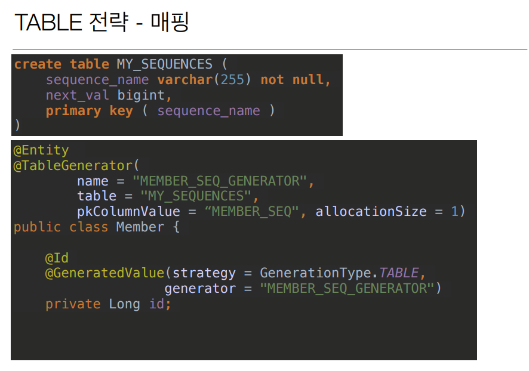

# 필드와 컬럼 매핑

```java
@Column(name = "name")
private String username;
```

- 위 처럼 객체는 username으로 쓰고 싶은대, DB 에 컬럼명으로 name이라고 쓰고 싶다면 
  **@Column어노테이션** 안의 `속성 name`에 **DB에서 쓰고 싶은 컬럼명을 쓰면 된다**.

```java
@Entity
class Member {
	
	@Id
	private Long id;
    
    @Column(name = "member_name", columnDefinition = "varchar(100) default `EMPTY`")
	private String name;
	
    private Integer age;
    
	@Enumerated(EnumType.STRING)
	private RoleType roleType;
	
	@Temporal(temporalType.TIMESTAMP)
	private Date createdDate; // 생성 일자
	
	@Temporal(TemporalType.TIMESTAMP)
	private Date lastModifiedDate; // 수정 일자
	
	// 기본 생성자
	// getter
	// setter
}
```

</br>

## 매핑 어노테이션 정리

>hibernate.hbm2ddl.auto

- @Column : **컬럼 매핑**
  - name : 필드와 매핑할 테이블 컬럼 이름, defalut = 객체의 필드 이름
  - insertable, updateable : 등록, 변경을 할건지 여부 defalut = True
  - **nullable****(DDL)** : **null 값의 허용 여부를 설정**한다. 
    - false로 설정하면 DDL 생성 시에 **not null 제약조건이 붙는다**.
    - **기본이 true**로 null을 허용.
  - unique(DDL) : @Table의 uniqueConstraints와 같지만 
    한 컬럼에 **간단히 유니크 제 약조건을 걸 때 사용**한다.
    - 얘는 잘 안쓴다. 유니크 제약조건 이름을 줄 수 없기 때문.
  - columnDefinition**(DDL)** : 데이터베이스 **컬럼 정보를 직접 줄 수있다**.
    - ex) columnDefinition = "varchar(100) default `EMPTY`"
  - **length****(DDL)** : 문자 길이 제약조건. `String 타입에만 사용`한다.
    - 기본 값 255
  - **precision, scale(**DDL)** :
    **BigDecimal 타입에서 사용**한다(BigInteger도 사용할 수 있다).  precision은 소수점을 포함한 전체 자 릿수를, **scale은 소수의 자릿수** 다. 참고로 **double, float 타입에는 적용되지 않는다**. 아주 큰 숫자나 **정 밀한 소수를 다루어야 할 때만 사용**한다. 
    - **아주 큰 숫자, 소수점이 필요**할때.
    - ex) percision=19, scale=2;
- @Enumerated : **enum 타입을 매핑**할 떄 사용. 
                   **EnumType.STRING (사용 권장)** ORDINAL 사용시 **큰 장애가 될 수 있다**. -> ORDINAL 사용 X.


- **@Temporal** : **날짜 타입(java.util.Date, java.util.Calendar)을 매핑할 때 사용**
                          참고: **LocalDate, LocalDateTime을 사용할 때는 생략 가능**(최신 하이버네이트 지원)


-  **@Lob** : BLOB, CLOB 매핑
  varchar을 넘어서는 **굉장히 큰 contents를 넣고싶으면 @Lob을 쓰면 된다**.
  
- **@Transient** : 특정 필드를 **컬럼에 추가시키지 않음**. -> 메모리에만 쓰고싶을 때 사용.


<br/>

## 기본 키 매핑


<br/>

### 기본키 매핑 방법

- **직접 할당**은 @Id 어노테이션만 쓰면 된다.


### IDENTITY 전략 - 특징 

-  **기본 키 생성**을 데이터베이스에 위임 
-  주로 MySQL, PostgreSQL, SQL Server, DB2에서 사용 (예: **MySQL의 AUTO_ INCREMENT**)  
-  JPA는 보통 **트랜잭션 커밋 시점에 INSERT SQL 실행** 
-  AUTO_ INCREMENT는 데이터베이스에 **INSERT SQL을 실행 한 이후에 ID 값을 알 수 있음** 
- IDENTITY 전략은 **em.persist() 시점에 즉시 INSERT SQL 실행 하고 DB에서 식별자를 조회**

<br/>


<br/>


<br/>


<br/>


- 저장할 때마다 계속 next로 call로 id값을 가져오면 네트워크를 타기 때문에 성능이 떨어진다.
  그래서 `최적화 하기 위해` **allocationSize는** 쉽게 말하자면 **next call 할 때** 
  **미리 50개 사이즈를 DB에 미리 올려놓고** 제가 **메모리 상에 1씩 쓰는 것이다**.
- 동시성 이슈 없이 다양한 문제를 해결해 준다.


<br/>


- 모든 DB에 다 적용할 수 있다.
- 테이블을 직접 사용하니 Lock도 걸릴 수 있고 성능이 떨어진다는 단점이 있다.

<br/>




